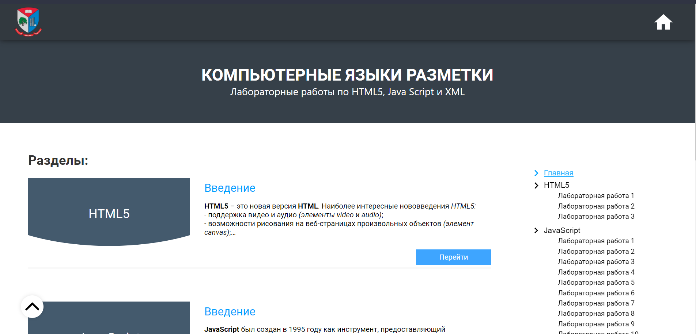
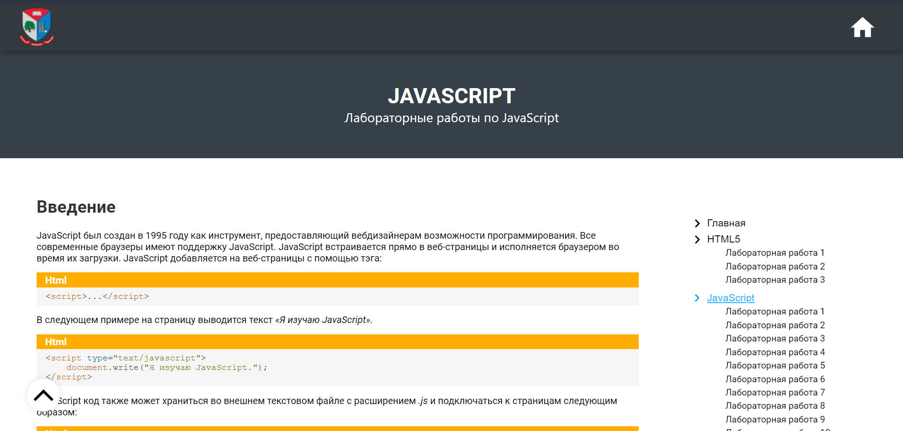
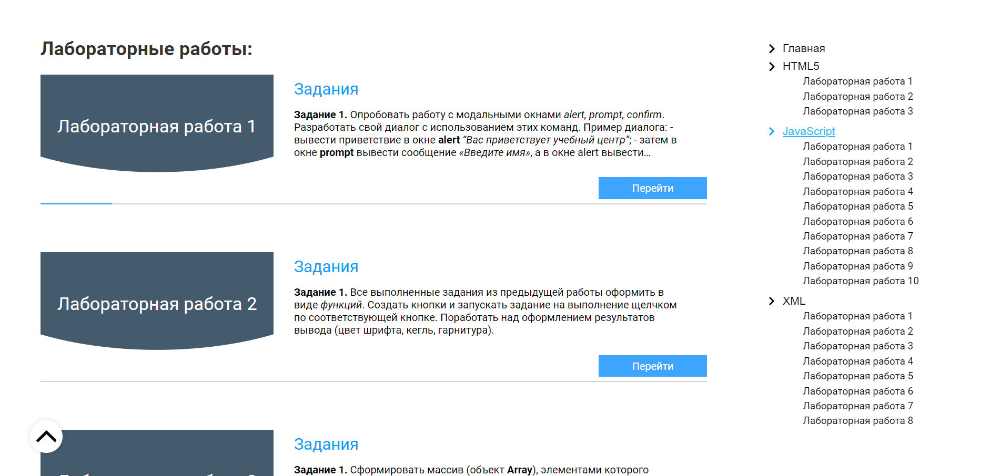
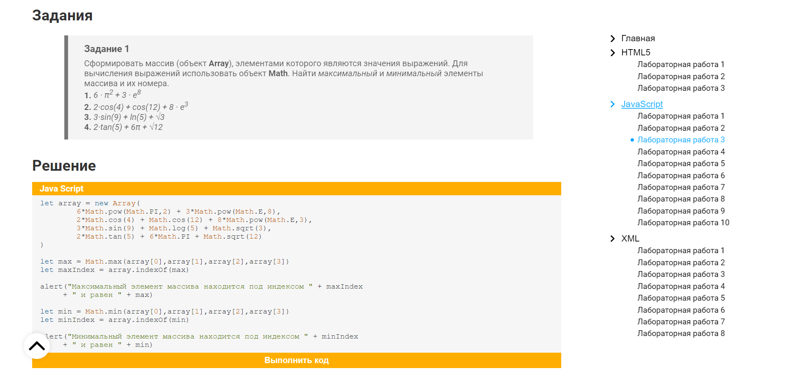

<h1 id="top" align="center" style="font-weight:">Computer Markup Languages labs</h1>

<h3 align="right" style="font-weight:">
  Try <a href="https://zif1r.github.io/firstproject.github.io/LabWorks/JavaScript/index.html">Live Demo</a>
</h3>

  
Table of contents:

  <ul>
    <li><a href="#description">Short review of project</a></li>
    <ul>
      <li><a href="#introduction">Introduction</a></li>
      <li><a href="#stack">Technological stack</a></li>
    </ul>
    <li><a href="#screenshots">Screenshots</a></li>
    <ul>
      <li><a href="#products">Products page</a></li>
      <li><a href="#cart">Cart page</a></li>
      <li><a href="#empty_cart">Empty-cart page</a></li>
    </ul>
  </ul>

<h1 id="description" style="font-size: 27px">Short review of project</h1>

<h2 id="introduction" style="text-decoration: underline">Introduction</h2>

It is my first project I created. It's a web-site which contains all labs for such subject of my university like "Computer Markup Languages". In this site I collected labs for HTML5/JavaScript/XML and my solutions for the tasks of labs.

<h2 id="stack" style="text-decoration: underline">Technological stack</h2>

This web-site built via:

- HTML
- CSS
- JavaScript
- XML

*I also used library [highlight.js](https://highlightjs.org/) for syntax highlighting.*

<h1 id="screenshots">Screenshots</h1>

<h3 id="products">Main page</h3>

<h3 id="cart">JavaScript-labs page</h3>

<h3 id="empty_cart">Labs list</h3>

<h3 id="empty_cart">Task example</h3>

